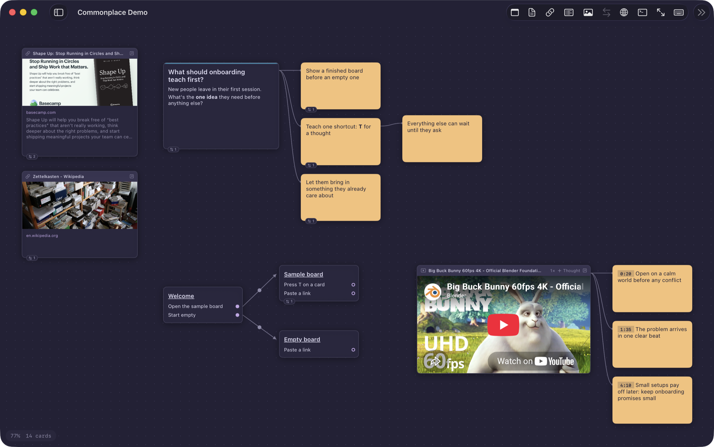
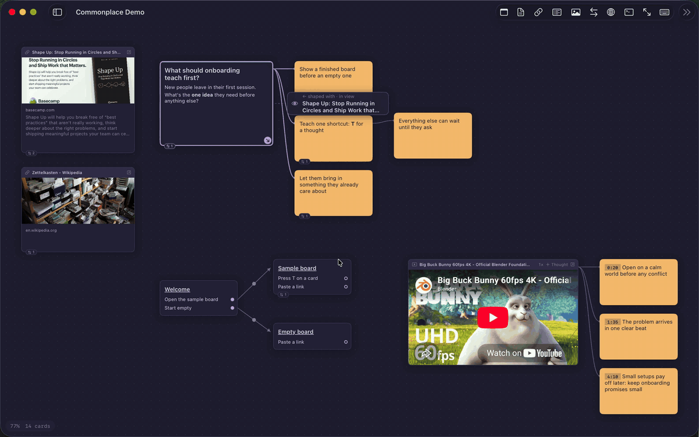

# Commonplace

A canvas for thinking, for macOS. Collect references (YouTube and X videos, links, images, quotes
clipped from the web), jot stickies and notes, sketch Shape Up breadboards, and connect it all into
a map of ideas you can explore.

Keyboard-first and themeable, in the spirit of [Omarchy](https://omarchy.org). Everything is stored
as plain Markdown files you own. Agents like Claude Code can work on your boards alongside you
through a built-in MCP server.

Inspired by commonplace books, Niklas Luhmann's Zettelkasten, Christopher Alexander's pattern
languages and Ryan Singer's Shape Up, without being a tool for any one of them.





<sub>Demo board built with `scripts/demo-board.sh`. Video: *Big Buck Bunny* © Blender Foundation,
CC BY 3.0. Link previews from basecamp.com and Wikipedia.</sub>

## Requirements

- macOS 14 or later
- Xcode 16 or later (or the Swift 6 toolchain), to build

## Build and run

```sh
git clone https://github.com/JoshAntBrown/commonplace.git
cd commonplace
scripts/run.sh            # debug build → build/Commonplace.app, then launch
scripts/build-app.sh      # release build
```

Open `Package.swift` in Xcode to work on it there. Press **?** in the app for every shortcut.

## Data

Everything lives in `~/Commonplace/<Board>/`:

- `cards/*.md` — one Markdown file per card, with YAML front-matter (kind, title, url, colour…)
- `board.json` — positions, sizes, connections and viewport
- `assets/` — images dropped or pasted onto the board

Markdown files dropped into `cards/` by hand appear on the board on next open.

## Adding cards

**S** (sticky), **N** (note) or **P** (place) shows a preview that follows the pointer: click to put
it there, or just start typing and it drops where the preview is. Return places it; Esc cancels.

## Moving around

Arrows (or **h j k l**) follow threads first: **←** to what the card follows from, **→** to its first
thought, **↑ ↓** through the thread; where a thread ends they move to the nearest card that way.
**U** adds a link or video by URL. **⌘1** fits the board, **⌘2** the selection, **⌘0** is 100% (on
the selection); **⌘=** / **⌘−** zoom.

## Focus

Press **F** (or right-click → Focus) to open one card up close: a video plays large, a note or
image fills the space. Beside it: what it follows from, its thoughts (a video's in time order, with
clickable timestamps), its references. Thoughts work like cards on the board: click to select, double-click or Return to edit, Delete to
remove, ↑ ↓ (or j k) to move, **T** / **⇧T** to add a thought or the next one. Choosing any other card in the panel focuses it instead. **Esc** goes
back to the board. With a video in focus: **Space** plays/pauses, **← →** (or h l) skip 5 s, **< >** change speed.

## Copy and paste

**⌘C** copies the selected cards (with their layout, and the threads and references among them),
**⌘V** pastes them under the pointer on any board, **⌘X** cuts, **⌘D** duplicates. Images come with
them between boards, and other apps receive the cards' Markdown.

## Vocabulary

- **Card**: anything on a board (sticky, note, link, video, image, place).
- **Thread**: the "follows from" link (`parent:` in front-matter). One per card, so a board is a set
  of trees, drawn as solid curves. **A** lines up the selected card's thoughts in a column (one level).
- **Thought** (**T**): a sticky drawn out of the selection and threaded to it; on a video it starts
  with the current time, which seeks the video when clicked. **⇧T**: the next thought after the
  selected one, below it in the same thread (after a video's thought: the next one on the video). **⇧C** then a click makes that card follow the selection.
- **Reference** (**C** then a click): "see also". Shown as a chip on the card and a floating list
  beside the selected card, not as lines (**R** draws them all). Right-click converts to a thread.
- **Wire**: a breadboard link from a place's affordance to a place; always drawn.

Deleting a card moves its children up to its parent. Older `thought-of` / `moment-of` keys load as
`parent`.

## Browser

Press **B** (or the globe button) for a browser beside the canvas. Search the web or images
(DuckDuckGo), then drag images, links or videos onto the board, or right-click for
**Add Image / Link / Selection / Page to Board**. Clipped images are saved into `assets/` and
remember their `source`; selected text becomes a quote note linking back to its page.

## Breadboards

Press **P** for a place card (Shape Up breadboarding): an underlined name, then one affordance per
line. Click the dot beside an affordance, then click a place, to draw the connection from that
affordance. Connections remember which affordance they start from (`fromItem` in `board.json`).

## Video

- YouTube: embedded via the IFrame API.
- X posts: the MP4 behind the post is resolved and played natively (AVKit).
- Vimeo and other pages: loaded in a web view.

Press **T** (or **+ Thought**) on a selected video to add a thought at the current time: a sticky
starting with the timestamp, threaded from the video. Click the timestamp to jump back.

Click **1×** in a video's title bar to step through speeds (hold for the full list), or use **[** and **]**.
Each video remembers its speed and where you left off (`speed:` and `position:` in its front-matter).

## Agents

Commonplace runs an MCP server (Streamable HTTP) inside the app at `http://127.0.0.1:7717/mcp`,
so agents work on the live boards: changes appear on the canvas and can be undone with ⌘Z.
It only listens on this machine, needs the bearer token in `~/Commonplace/.mcp-token`, and refuses
requests from web pages.

- **Terminal panel** (⌃\` or the terminal button): a shell in `~/Commonplace`. Run `claude` there
  and it picks up the server (`.mcp.json`) and the skill (`.claude/skills/commonplace`).
- **Anywhere else:** Agents → Copy Claude Code Setup Command, then paste it in a terminal. Agents →
  Install Skill for Claude Code puts the skill in `~/.claude/skills/commonplace`.
- The skill lives in `skills/commonplace/SKILL.md` and ships inside the app bundle.

Tools: list_boards, get_board, get_card, search, get_selection, get_video_thoughts, add_card,
add_thought, update_card, add_reference, set_thread, tidy_thread, clip_url, delete_card, create_board,
focus_card.

Files edited outside the app (another editor, a script) are picked up and reloaded.

## Ideas

Parked ideas live in [docs/ideas.md](docs/ideas.md).

## License

[MIT](LICENSE)
